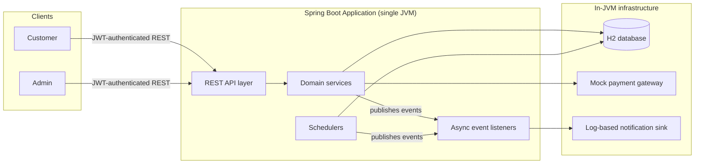
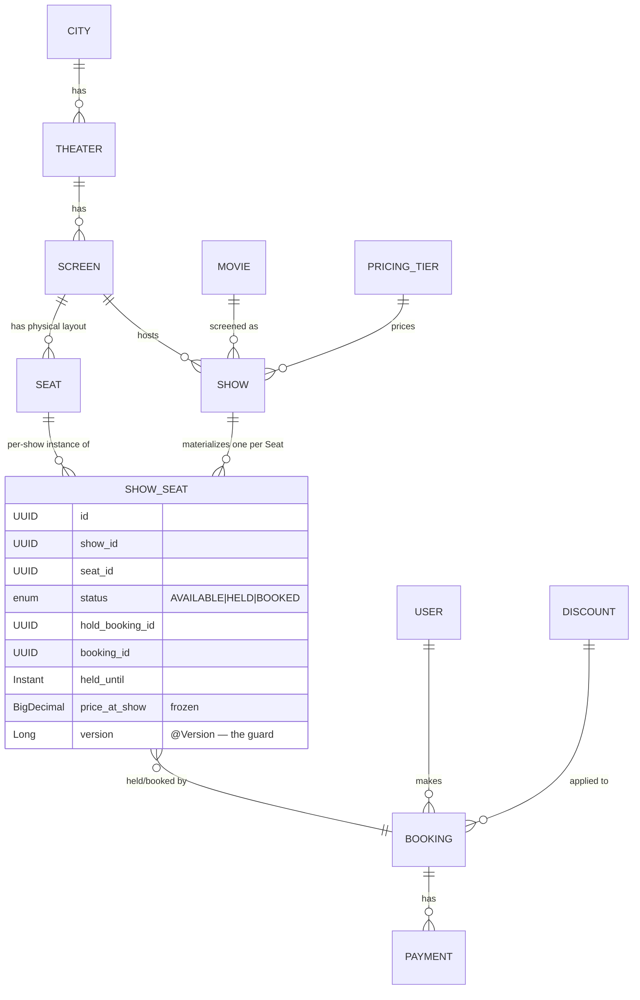
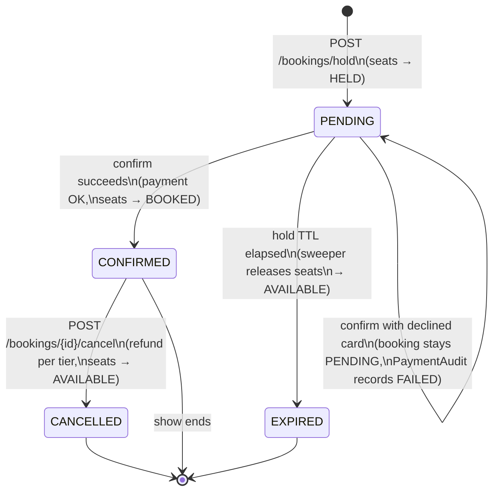
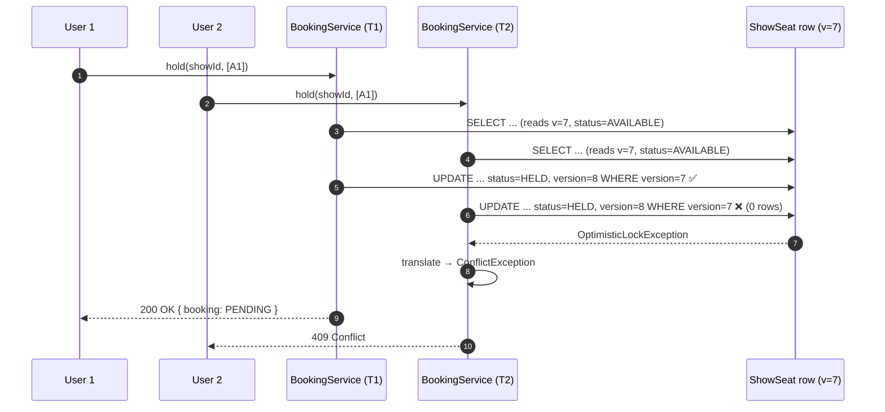
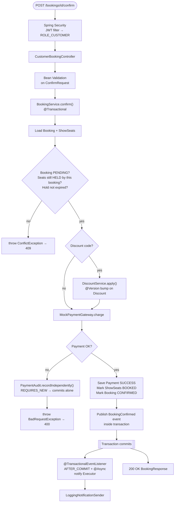
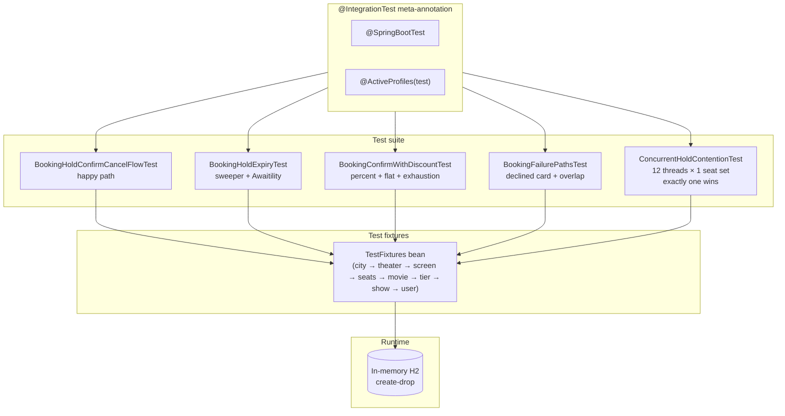
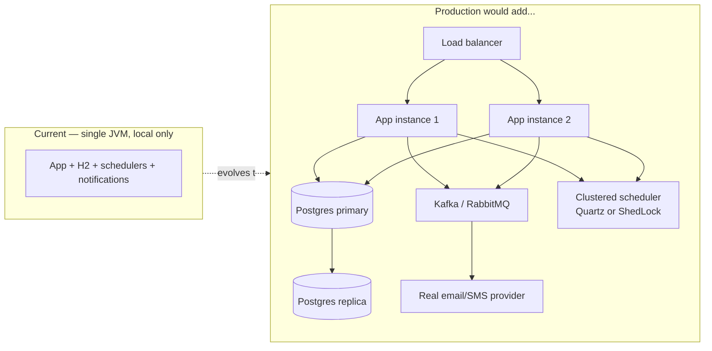

# Diagrams — Movie Ticket Booking System

Visual companion to the design docs. Every diagram is Mermaid — renders live in GitHub, VS Code (Markdown preview or a Mermaid extension), and most Markdown tools.

**Contents:**
1. [System context](#1-system-context)
2. [Domain model](#2-domain-model)
3. [Booking state machine](#3-booking-state-machine)
4. [Concurrency race — why `@Version` wins](#4-concurrency-race--why-version-wins)
5. [Confirm request end-to-end](#5-confirm-request-end-to-end)
6. [Test topology](#6-test-topology)
7. [Deployment topology — current vs. production](#7-deployment-topology--current-vs-production)

---

## 1. System context

Who talks to what. Everything on the right of the outer boundary is in-process.



In production, H2 would become Postgres, the notification sink would become a queue with a real email/SMS provider — but the interfaces stay the same.

---

## 2. Domain model

The five entities that carry the booking flow, plus where the concurrency guard lives.



Everything above `SHOW_SEAT` is catalog — cities, theaters, screens, physical seats. `SHOW_SEAT` is where bookings actually happen: one row per show per seat, carrying `@Version` and the frozen price.

---

## 3. Booking state machine



Four states. `PENDING → EXPIRED` is driven by the scheduled sweeper. `PENDING → PENDING` on a declined card leaves the booking untouched but writes a durable FAILED payment row via `PaymentAudit`'s `REQUIRES_NEW` transaction.

---

## 4. Concurrency race — why `@Version` wins

The scenario the whole design exists to prevent: two users, same seat, same instant.



Both threads read `version = 7`. Only one `UPDATE WHERE version = 7` matches — the other updates zero rows and Hibernate throws. The service catches it and returns 409. No locks held for the duration of the request; losers lose fast.

---

## 5. Confirm request end-to-end

Everything a `POST /bookings/{id}/confirm` touches, in order.



Two branches worth calling out:

- **`PaymentAudit`** runs in its own `REQUIRES_NEW` transaction, so a FAILED payment row survives the outer rollback.
- **Event listener** runs *after commit* on a different thread, so a rolled-back booking never notifies.

---

## 6. Test topology

The layered test strategy.



Every test goes through the same `@IntegrationTest` annotation, seeds through the same `TestFixtures` bean, runs against in-memory H2. `ConcurrentHoldContentionTest` is the load-bearing one — twelve threads racing, exactly one wins.

---

## 7. Deployment topology — current vs. production

What's here vs. what a production version would add.



Everything on the right is explicitly out of scope for this codebase. The internal seams are already right — `PaymentGateway` is an interface, notifications are events, the scheduler is a bean — so swapping in the production versions wouldn't change the domain code.

---

## Rendering to PNG

Fastest path:

1. Copy the Mermaid block.
2. Open <https://mermaid.live>.
3. Paste, then **Actions → PNG** (transparent background looks best on dark themes).

Offline via CLI:

```bash
npm install -g @mermaid-js/mermaid-cli
mmdc -i docs/DIAGRAMS.md -o diagram.png -t dark -b transparent
```
